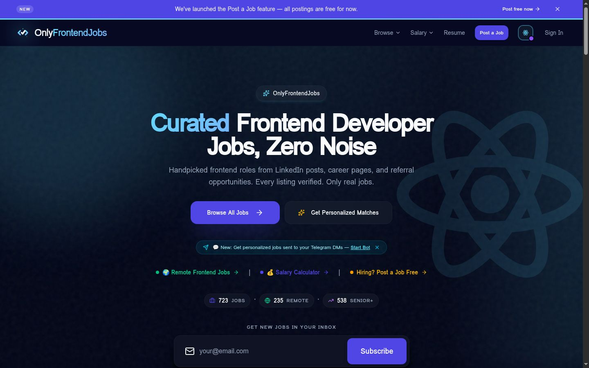
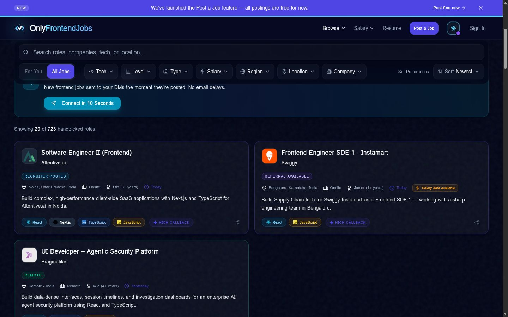
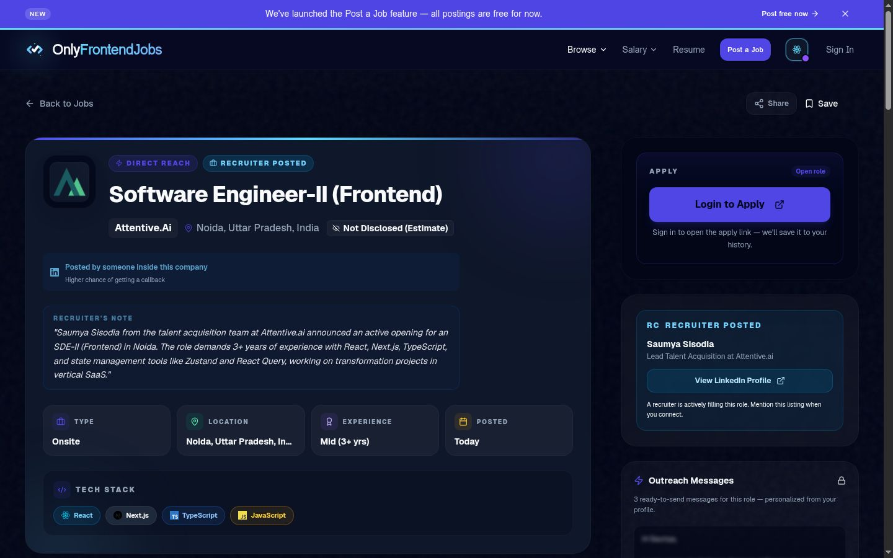
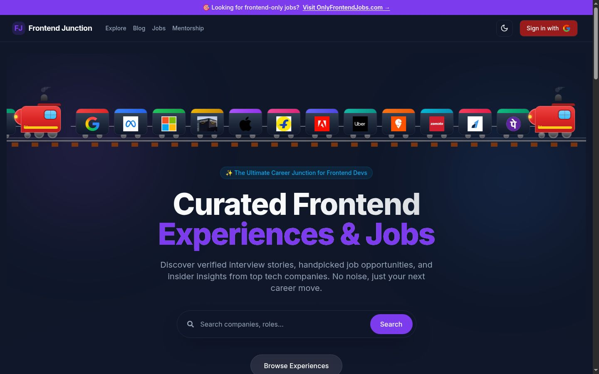

# Deepak Sharma

**Senior Frontend Engineer at Target. Building [OnlyFrontendJobs](https://onlyfrontendjobs.com), a frontend-only career platform helping developers find roles through better data and real human paths.**

I build frontend products that help developers find work, prepare better, and understand the web.

---

## Flagship: OnlyFrontendJobs

**The problem:** frontend developers wade through generic job boards full of backend, PM, and data noise. **The outcome:** a board where every listing is a frontend role, hand-verified, with real salary data and direct paths to the humans hiring.

🌐 **Live product: [onlyfrontendjobs.com](https://onlyfrontendjobs.com)**

| Homepage | Job search | Role detail |
|---|---|---|
|  |  |  |

**Verified numbers (as of Sep 19, 2026, from the live site):**

- **723 curated frontend roles** live on the board (235 remote, 538 senior+)
- **Public jobs API** in production — `onlyfrontendjobs.com/api/public/jobs` — serving live listings to third-party AI agents
- **MCP server** (`onlyfrontendjobs.com/api/mcp`) powering [FrontendJobSkills](https://github.com/deepu0/FrontendJobSkills), my open-source agent toolkit

**What I own:** product, frontend, data pipeline design, and go-to-market — end to end. (The application source is private by choice; everything above is publicly observable.)

**Key product/technical decisions:**

- **Frontend-only taxonomy** — every listing is classified by tech stack (React, Next.js, TypeScript, Vue, Angular, Svelte) so search is signal, not keyword spam.
- **Provenance over volume** — listings carry source signals (recruiter-posted, referral available, salary data) instead of raw scraped volume; fewer, better roles.
- **API-first distribution** — the same inventory powers the site, a public REST API, and an MCP server, so the data reaches developers inside the tools they already use.

**Case study (public):** OnlyFrontendJobs started as a curated list of frontend roles I maintained for my own job-search community. The recurring complaint was that mainstream boards bury frontend roles under generic "software engineer" noise. I rebuilt it as a dedicated product: a Next.js application with a curation pipeline, structured salary and experience metadata, and Telegram alerts. It now serves hundreds of live roles daily and exposes its inventory programmatically — which is what made the FrontendJobSkills agent integration possible without any scraping by third parties.

**[→ Explore OnlyFrontendJobs](https://onlyfrontendjobs.com)**

---

## Proof (dated, verifiable)

| Proof | Value | Source | As of |
|---|---|---|---|
| Topmate mentorship | 4.5/5 · 206 ratings · 1.4k bookings · 157 testimonials | [topmate.io/deepak_sharma](https://topmate.io/deepak_sharma/) | Sep 19, 2026 |
| OnlyFrontendJobs inventory | 723 live roles (235 remote, 538 senior+) | [onlyfrontendjobs.com](https://onlyfrontendjobs.com) | Sep 19, 2026 |
| LinkedIn Exact Applicant Counter | 133 users · 2.5/5 (6 ratings) | [Chrome Web Store](https://chromewebstore.google.com/detail/linkedin-exact-applicant/bckkpagmbcpfomemacgpcladlpdckiop) | Sep 19, 2026 |
| Next.js Detector | 69 users · 4.7/5 (3 ratings) | [Chrome Web Store](https://chromewebstore.google.com/detail/nextjs-detector/ipfpjgnhbgimgfpjjabeafphchkhimah) | Sep 19, 2026 |
| EkSaath | 3 users · 5.0/5 (1 rating) | [Chrome Web Store](https://chromewebstore.google.com/detail/eksaath-%E2%80%94-group-tabs-by-d/dmbddhflionebnjhlopafpggcegkkklo) | Sep 19, 2026 |
| WhatStack | 5 users | [Chrome Web Store](https://chromewebstore.google.com/detail/whatstack/kpmbanlddakoocgimdenfeppfaidmcgk) | Sep 19, 2026 |
| festive-ui on npm | v2.0.0 | [npmjs.com/package/festive-ui](https://www.npmjs.com/package/festive-ui) | published Dec 24, 2025 |

---

## Selected products

### [FrontendJobSkills](https://github.com/deepu0/FrontendJobSkills) — AI agent skills for frontend job search

Resume scoring (0–100 rubric), JD analysis, tailoring, interview prep, and live OnlyFrontendJobs listings — inside ChatGPT, Cursor, Claude, Codex, and 30+ agents via `npx skills`.

- **Status:** active, v1.2.x, MIT licensed, CI-gated releases
- **Capabilities:** 11 skills; evidence-based resume rubric synced with the OnlyFrontendJobs resume tool
- **Architecture:** plain Markdown `SKILL.md` files per skill, synced to multiple agent formats by script; no runtime, no server — the agent is the runtime. *Tradeoffs:* Markdown-only skills are trivially portable but can't enforce behavior, so every scoring rule carries verbatim-quote requirements; live jobs come from the OFJ API rather than embedded data, which adds a network dependency but keeps listings fresh.
- **Try in 60 seconds:** `npx skills add deepu0/FrontendJobSkills --skill '*' -g -a '*' -y`, then ask your agent: *"Score my frontend resume"*
- **Tests/CI:** release-check script runs in CI on every PR

### [Frontend Junction](https://github.com/deepu0/frontend-junction) — frontend interview experiences, open-sourced

Real, round-by-round interview experiences from 100+ companies so candidates prepare from evidence, not hearsay. Live at [frontend-junction.com](https://www.frontend-junction.com).

- **Status:** live, public domain (Unlicense), community submissions open
- **Capabilities:** 106+ interview experiences, 103 company profiles, 23 technical blog posts (repo README, Sep 2026), full-text search, admin moderation pipeline
- **Stack:** Next.js 15 · TypeScript · Supabase · Tailwind · MDX · Gemini-assisted content pipeline
- **Setup in 60 seconds:** `git clone` → `npm install` → `cp .env.example .env.local` (add Supabase keys) → `npm run dev`
- **CI:** GitHub Actions — lint, type check, security audit, bundle size, Lighthouse

### [EkSaath](https://github.com/deepu0/ek-saath) — group tabs by domain

For tab hoarders: one click groups tabs by domain, shows duplicates, closes extras with 30s undo.

- **Status:** live on the [Chrome Web Store](https://chromewebstore.google.com/detail/eksaath-%E2%80%94-group-tabs-by-d/dmbddhflionebnjhlopafpggcegkkklo) — 3 users, 5.0/5 (Sep 19, 2026); Manifest V3
- **Privacy:** `tabs` + `storage` only; no data leaves the device
- **Try it:** `chrome://extensions` → Developer mode → Load unpacked → repo root

### [WhatStack](https://github.com/deepu0/whatstack) — what stack is this page using?

Local-only tech-stack detection: frameworks, microfrontends, analytics, hosting — with confidence tiers and per-hit evidence. No cloud matching, no page upload.

- **Status:** live on the [Chrome Web Store](https://chromewebstore.google.com/detail/whatstack/kpmbanlddakoocgimdenfeppfaidmcgk) — 5 users (Sep 19, 2026); Manifest V3
- **Quality:** `node:test` unit/integration suites plus a real-Chrome Playwright end-to-end suite; detection evidence comes only from live DOM probes, never from page HTML as text
- **Try it:** clone → Load unpacked → open any site → click the toolbar icon

### [LinkedIn Exact Applicant Counter](https://github.com/deepu0/linkedin-extension) — real applicant counts on LinkedIn jobs

LinkedIn shows "100+ applicants" even with Premium. This shows the exact number on the job page, per-tab opt-in.

- **Status:** live on the [Chrome Web Store](https://chromewebstore.google.com/detail/linkedin-exact-applicant/bckkpagmbcpfomemacgpcladlpdckiop) — 133 users, 2.5/5 (6 ratings), Sep 19, 2026. Depends on LinkedIn's internal API responses, so accuracy can break when LinkedIn changes them.
- **Privacy:** no data collected or transmitted; reads only what's already in the page's own API responses

### Also

- **[festive-ui](https://github.com/deepu0/festive-ui)** — 14 festive particle effects (snow, confetti, diyas, fireworks) for React/vanilla JS. TypeScript, object pooling, `prefers-reduced-motion` support. `npm install festive-ui`
- **[Next.js Detector](https://github.com/deepu0/nextjs-detector)** — Chrome extension that detects Next.js sites and their version. 69 users, 4.7/5 on the [Chrome Web Store](https://chromewebstore.google.com/detail/nextjs-detector/ipfpjgnhbgimgfpjjabeafphchkhimah) (Sep 19, 2026)

---

## Trust & contact

- 💼 **LinkedIn:** [linkedin.com/in/depaksharma](https://www.linkedin.com/in/depaksharma/) — fastest professional route
- 📞 **Topmate:** [topmate.io/deepak_sharma](https://topmate.io/deepak_sharma/) — book a 1:1 (mock interviews, resume reviews, job-switch strategy)
- 🌐 **Product:** [onlyfrontendjobs.com](https://onlyfrontendjobs.com)

If you're hiring for senior frontend roles, building for developers, or want to collaborate on career tooling — LinkedIn is the best first touch.
